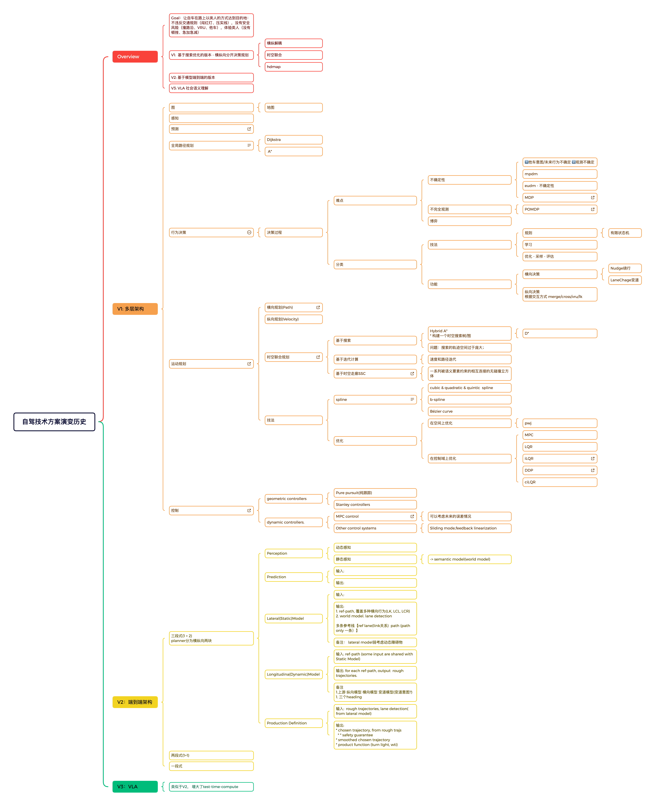

### Hi there 👋

- 🚀 马斯克🚀 的粉丝
- 🔭 自动驾驶行业, [🏃 这里有我做过的项目](./projects.md) 
- 🌱 目前在学习这些[论文/算法/课程](./learning_material.md)
- 💬 可以聊聊: 自动驾驶[方案](./projects.md#展望) 经典/最新的感知、规控技术; 编程; 数学.
  - [Tesla V14 分享](https://captaincaptain.notion.site/A-Peek-into-Tesla-s-Autonomous-Future-Core-Tech-Revealed-by-VP-Ashok-Elluswamy-at-ICCV25-WDFM-AD-2d7b1f9d11a08092aaa3c6c31589ad72?source=copy_link)
  

   <a>自动驾驶技术发展历史</a> 
    
  

- 📫 联系我: email(ljlsmail520 dot gmail dot com)/wechat(hardlabcaptain)

<!--

- Project | LCC横向规划方案 
  通过微分法进行横向规划. 重新设计了架构, 支持 1)实车问题的快速复现 2) 快速调参
- Project | 规控算法可复现可视化快速迭代工具
  - Cpp with Python via Pybind, using Bokeh to plot interactively.
- [Project | 数据驱动规划](https://www.notion.so/captaincaptain/e0f1d58cf80a4ebbbd23ba627d5f818c?pvs=4)   
  通过深度学习进行决策规划
- Project | 规控评测体系  
  规控算法迭代的大规模评测体系: 场景搭建 & 自动评测.
  - 体系架构
    - 场景
    - 评测器
  - 自动化评测
    - 特征体系
    - 模型/超参搜索(AutoML)
    - [模型自我迭代](https://docs.google.com/drawings/d/1qygI_3szCH37xL6nOGwrCXcsHnyxEcGzLJwTETHm4fo/edit?usp=sharing)

- [Project | **评测器工具集**](): A simple tool with UI to interact with multi-platform    
  * 评测工具集填补了工作流程中空白. 在此之前,RD开发过程中没有达标的开发工具.

  * 通过评测工具集,RD可以很方便地与组织内不同的数据/仿真平台交互,提高了工作流程效率. 

  * 评测工具集使用了fastapi来搭建web框架.前端为一个简单的html网页,后端接收界面请求并调用组织不同平台的API完成对应的功能.

- Project | 仿真
  - WroldSim: [Common Road](https://commonroad.in.tum.de/)      
    1. 使用Common Road构建自驾所需要的场景,[评估规控模块在这个场景下的效果](https://docs.google.com/document/d/1TTZk28jI2OWGVR1Z_IVYsvZBPN9IFzbVqJp8jh6vThE/edit?usp=sharing). 

- Project | 强化学习
  
  基于 Common Road 构建的场景,使用[Actor-Critic算法训练Planner](https://docs.google.com/document/d/1TTZk28jI2OWGVR1Z_IVYsvZBPN9IFzbVqJp8jh6vThE/edit#heading=h.68j4bct6elkb). 

**JinlongLi2016/JinlongLi2016** is a ✨ _special_ ✨ repository because its `README.md` (this file) appears on your GitHub profile.

Here are some ideas to get you started:

- 🔭 I’m currently working on ...
- 🌱 I’m currently learning ...
- 👯 I’m looking to collaborate on ...
- 🤔 I’m looking for help with ...
- 💬 Ask me about ...
- 📫 How to reach me: ...
- 😄 Pronouns: ...
- ⚡ Fun fact: ...

- [课程 | Reinforcement Learning]([https://captaincaptain.notion.site/ecacdf9a2c4246cdb82ada3f1a48f5a5](https://www.notion.so/captaincaptain/Reinforcement-Learning-a3b749a050204744a4df23b8efcb9e5e?pvs=4)https://www.notion.so/captaincaptain/Reinforcement-Learning-a3b749a050204744a4df23b8efcb9e5e?pvs=4)
-->
