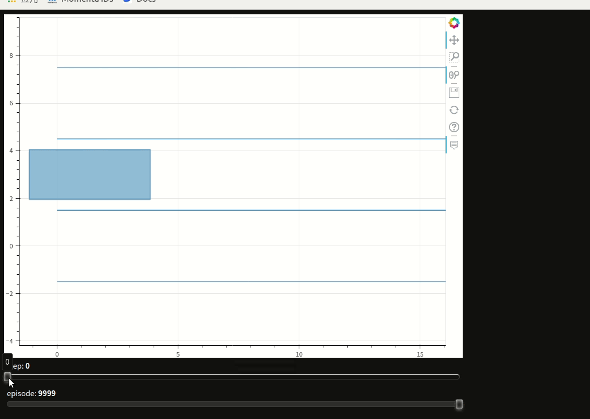

### Hi there 👋

- 🚀 马斯克🚀 的粉丝
- 🔭 自动驾驶行业, [🏃 这里有我做过的项目](./projects.md) 
- 💬 可以聊聊: 自动驾驶[方案](./projects.md#展望) 经典/最新的感知、规控技术; 编程; 数学.
- 🌱 目前在学习这些[论文/算法/课程](./learning_material.md)
- 📫 联系我: ljlsmail520 dot gmail dot com

### 自动驾驶项目

下面是我从事过的一些自动驾驶相关项目,描述了一些技术实现.

- Project | **ACC/LCC横向规划方案**   
  
  通过变分法(variational method)进行横向规划. 重新设计了架构, 支持实车问题的快速复现.

- Project | **规控算法可复现可视化快速迭代工具**  
  - 使用变分法(variational method)进行规划时, cost的设计和调参是一个难题: 应该调整哪一个参数调高一点还是低一点? 工具对这个问题提供了一个解决方案。通过这个工具，可以快速地对不同cost的效果进行可视化，指导调参.
  - 使用C++、Python联合开发, 基于bokeh进行交互式可视化.

- Project | **数据驱动规划**  

  通过深度学习进行决策规划. 网络模型可以参考 Transformer, MultiPath/TNT, VectorNet. 为了玩转这些网络, 需要对整个pipeline上上的做改变, 把控数据流.

- Porject | **强化学习 Planner**   
    1. 基于Common Road构建的场景,使用[Actor-Critic算法训练Planner](https://docs.google.com/document/d/1TTZk28jI2OWGVR1Z_IVYsvZBPN9IFzbVqJp8jh6vThE/edit#heading=h.68j4bct6elkb).  

        
        
        案例中case是在本地电脑上训练，证明了强化学习模型可以收敛. 实验设置可以在参考链接中查看.更好的结果 & 复杂的场景 需要对cost进行更精细的设计 & 更强大训练资源.

- Project | **规控评测体系**  
  规控算法迭代的大规模评测体系: 场景搭建 & 自动评测.
  - 体系架构
    - 场景(log-sim)
    - 评测器(自动评估规控效果)
  - 自动化评测
    - 特征体系
    - 模型/超参搜索
    - [模型迭代](https://docs.google.com/drawings/d/1qygI_3szCH37xL6nOGwrCXcsHnyxEcGzLJwTETHm4fo/edit?usp=sharing)

- Project | **评测器工具集**: A simple tool with UI to interact with multi-platform    
  * 评测工具集填补了工作流程中空白. 在此之前,RD开发过程中没有达标的开发工具.通过评测工具集,RD可以很方便地与组织内不同的数据/仿真平台交互,提高了工作流程效率.    
  * 评测工具集使用了fastapi来搭建web框架.前端为一个简单的html网页,后端接收界面请求并调用组织不同平台的API完成对应的功能.

<!--

- Project | LCC横向规划方案 
  通过微分法进行横向规划. 重新设计了架构, 支持 1)实车问题的快速复现 2) 快速调参
- Project | 规控算法可复现可视化快速迭代工具
  - Cpp with Python via Pybind, using Bokeh to plot interactively.
- [Project | 数据驱动规划](https://www.notion.so/captaincaptain/e0f1d58cf80a4ebbbd23ba627d5f818c?pvs=4)   
  通过深度学习进行决策规划
- Project | 规控评测体系  
  规控算法迭代的大规模评测体系: 场景搭建 & 自动评测.
  - 体系架构
    - 场景
    - 评测器
  - 自动化评测
    - 特征体系
    - 模型/超参搜索(AutoML)
    - [模型自我迭代](https://docs.google.com/drawings/d/1qygI_3szCH37xL6nOGwrCXcsHnyxEcGzLJwTETHm4fo/edit?usp=sharing)

- [Project | **评测器工具集**](): A simple tool with UI to interact with multi-platform    
  * 评测工具集填补了工作流程中空白. 在此之前,RD开发过程中没有达标的开发工具.

  * 通过评测工具集,RD可以很方便地与组织内不同的数据/仿真平台交互,提高了工作流程效率. 

  * 评测工具集使用了fastapi来搭建web框架.前端为一个简单的html网页,后端接收界面请求并调用组织不同平台的API完成对应的功能.

- Project | 仿真
  - WroldSim: [Common Road](https://commonroad.in.tum.de/)      
    1. 使用Common Road构建自驾所需要的场景,[评估规控模块在这个场景下的效果](https://docs.google.com/document/d/1TTZk28jI2OWGVR1Z_IVYsvZBPN9IFzbVqJp8jh6vThE/edit?usp=sharing). 

- Project | 强化学习
  
  基于 Common Road 构建的场景,使用[Actor-Critic算法训练Planner](https://docs.google.com/document/d/1TTZk28jI2OWGVR1Z_IVYsvZBPN9IFzbVqJp8jh6vThE/edit#heading=h.68j4bct6elkb). 

**JinlongLi2016/JinlongLi2016** is a ✨ _special_ ✨ repository because its `README.md` (this file) appears on your GitHub profile.

Here are some ideas to get you started:

- 🔭 I’m currently working on ...
- 🌱 I’m currently learning ...
- 👯 I’m looking to collaborate on ...
- 🤔 I’m looking for help with ...
- 💬 Ask me about ...
- 📫 How to reach me: ...
- 😄 Pronouns: ...
- ⚡ Fun fact: ...

- [课程 | Reinforcement Learning]([https://captaincaptain.notion.site/ecacdf9a2c4246cdb82ada3f1a48f5a5](https://www.notion.so/captaincaptain/Reinforcement-Learning-a3b749a050204744a4df23b8efcb9e5e?pvs=4)https://www.notion.so/captaincaptain/Reinforcement-Learning-a3b749a050204744a4df23b8efcb9e5e?pvs=4)
-->
