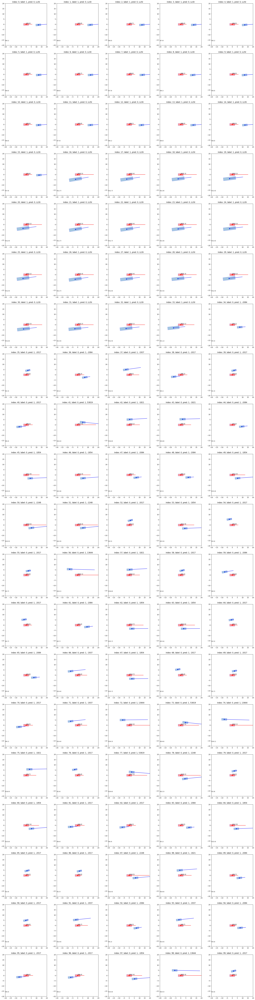
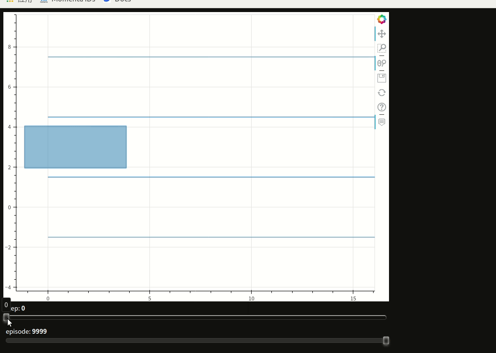

### 项目
下面是我从事过的一些自动驾驶相关项目,描述了一些技术实现.

- Project | **ACC横向规划方案**   
  
  通过变分法(variational method)进行横向规划. 重新设计了架构, 支持实车问题的快速复现.

- Project | **规控算法可复现可视化快速迭代工具**  
  - 使用变分法(variational method)进行规划时, cost的设计和调参是一个难题: 应该调整哪一个参数调高一点还是低一点? 工具对这个问题提供了一个解决方案。通过这个工具，可以快速地对不同cost的效果进行可视化，指导调参.
  - 使用C++、Python联合开发, 基于bokeh进行交互式可视化.

- Project | **数据驱动规划**  

  通过深度学习进行决策规划. 网络模型可以参考 Transformer, MultiPath/TNT, VectorNet [code](./codes/vectornet.py). 为了玩转这些网络, 需要调整pipeline, 把控数据流.
  

    
  

- Porject | **强化学习 Planner**   
    1. 基于Common Road构建的场景,使用[Actor-Critic算法训练Planner](https://docs.google.com/document/d/1TTZk28jI2OWGVR1Z_IVYsvZBPN9IFzbVqJp8jh6vThE/edit#heading=h.68j4bct6elkb).  

          

              
          

          
        案例中case是在本地电脑上训练，证明了强化学习模型可以收敛. 实验设置可以在参考链接中查看.更好的结果 & 复杂的场景 需要对cost进行更精细的设计 & 更强大训练资源.

- Project | **规控评测体系**  
  规控算法迭代的大规模评测体系: 场景搭建 & 自动评测.
  - 体系架构
    - 场景(log-sim)
    - 评测器(自动评估规控效果)
  - 自动化评测
    - 特征体系
    - 模型/超参搜索
    - [模型迭代](https://docs.google.com/drawings/d/1qygI_3szCH37xL6nOGwrCXcsHnyxEcGzLJwTETHm4fo/edit?usp=sharing)

- Project | **评测器工具集**: A simple tool with UI to interact with multi-platform    
  * 评测工具集填补了工作流程中空白. 在此之前,RD开发过程中没有达标的开发工具.通过评测工具集,RD可以很方便地与组织内不同的数据/仿真平台交互,提高了工作流程效率.    
  * 评测工具集使用了fastapi来搭建web框架.前端为一个简单的html网页,后端接收界面请求并调用组织不同平台的API完成对应的功能.

- Project | **仿真环境**
  - Wrold-Sim: [Common Road](https://commonroad.in.tum.de/)
    1. 使用Common Road构建自驾所需要的场景,[评估规控模块在这个场景下的效果](https://docs.google.com/document/d/1TTZk28jI2OWGVR1Z_IVYsvZBPN9IFzbVqJp8jh6vThE/edit?usp=sharing).   

### 展望

这一部分描述了对不同厂商技术实现的调研 及 自己未来的一些思考

* [xpeng](./resources/xpeng/)
* [telsa](./resources/tesla/)
