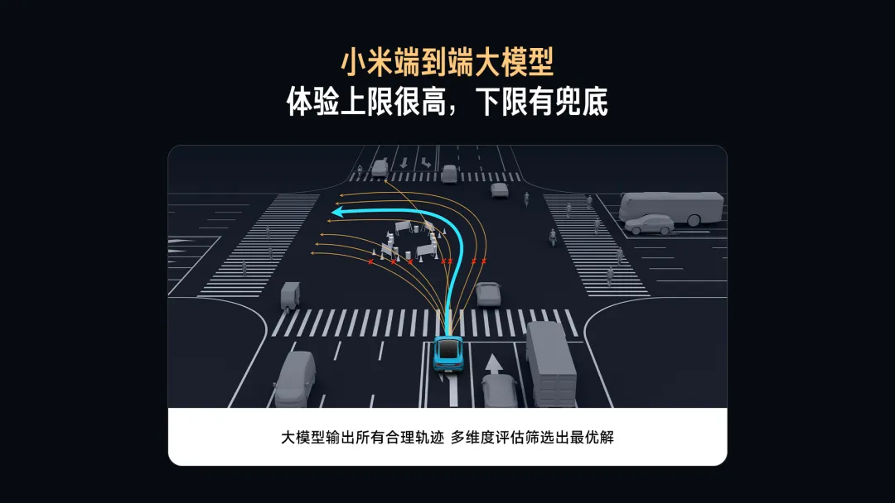

# 小米端到端

目前主流的端到端大模型是生成式大模型，**直接生成一条执行轨迹**，如果训练不到位，就会出现很多莫名其妙的“幻觉”，这也是我们说的下限很低。

从模仿轨迹转为筛选轨迹。**大模型首先实时生成所有合理的行驶轨迹，进而逐一考量安全、舒适、合规、效率等各方面因素，选择最优解并执行**。从照猫画虎的模仿者变成明辨是非的评判者，在体验不变的前提下，<u>做到了下限有兜底，体验更稳定，更舒适</u>。

1. 评估靠模型还是规则

> 进而逐一考量安全、舒适、合规、效率等各方面因素
>
> 这一步靠模型还是规则？XM英国采用的是规则，因为提到了“安全、舒适、合规、效率等各方面因素”字眼

2. 轨迹生成模型是如何训练的？

​	

ReferenceLink:

1.  [什么是端到端大模型？小米端到端大模型有何不同？](https://mp.weixin.qq.com/s/KAbIcb_iYx7x2VwRrtnTRA)：
2. [小米端到端](https://www.notion.so/captaincaptain/141b1f9d11a0806c9b3ff8a958d02629?pvs=4)