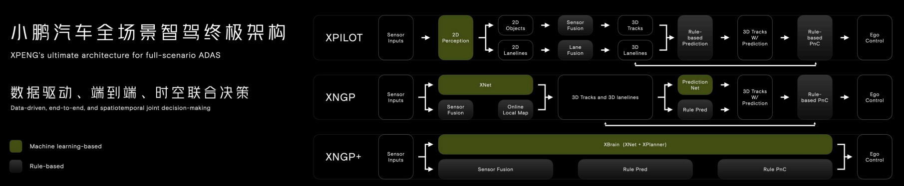

# 2023-10-24: xpeng科技日

* xpeng architecture outline

* XBrain - XNet2.0: 具有时空理解能力的感知架构

    融合了动静态感知及占据网络的感知

* XBrain - XPlanner: 基于神经网络的规划与控制

    基于神经网络

    1. 长时序
    1. 多对象
    1. 强推理

* WrokFlow

    * 数据生产
    * 数据标注
        * 自动
        * 人工
    * 模型训练, CI/CD
        * 模型训练数据整理
    * 评测(仿真)
        * 数据源
            * 采集得到的数据中挖掘
            * 生成式算法自动生成（极限场景）：基于真实道路情况批量生成
        * 大规模仿真
            * 专项评测集: 3.6w+
            * 核心模拟场景: 1.2w+
        * 有了场景之后，自动评测是怎么做的？    
    * 代码部署（OTA）

---
more

* 2023-10-24: xpeng科技日 [ppt](https://pan.baidu.com/s/1gotBxDgyhAOdu2FOXi0kTQ) [video](https://www.bilibili.com/video/BV1nM411X7Xg)

* [2022-05-15:深度解读小鹏和特斯拉各自的自动驾驶实力 PDF](http://www.evinchina.com/articleshow-356.html)
    * 小鹏 与 tesla 对比 （比较了哪些方面，两者的情况如何？）
* [2021-10-12: 解读：特斯拉、理想、蔚来、小鹏智能化自动驾驶布局](http://www.evinchina.com/huodongshow-103.html)